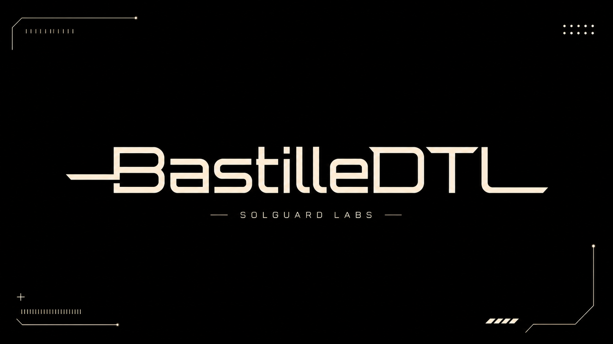
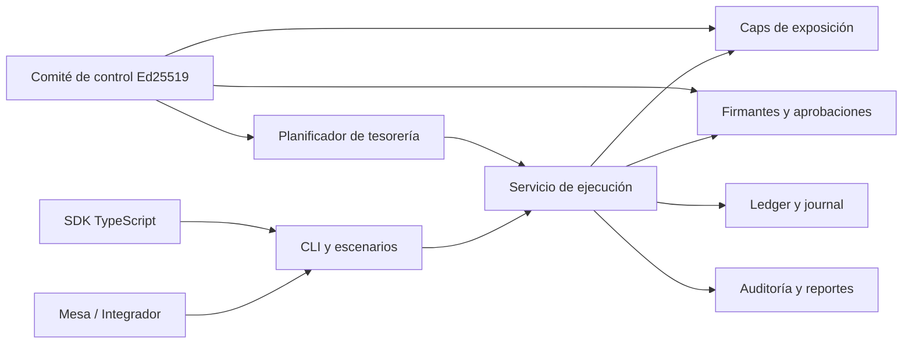
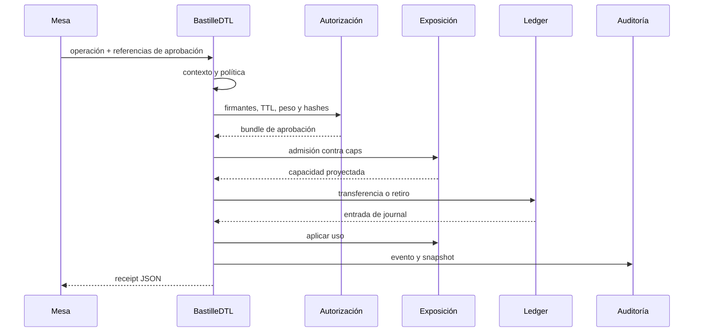
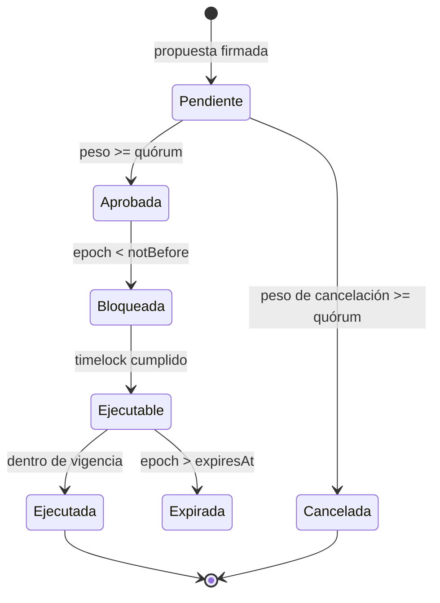

# BastilleDTL



BastilleDTL es un motor institucional de tesorería y liquidación escrito en
Go. Coordina cuentas multi-activo, movimientos internos, retiros por rails
externos, límites de exposición, aprobación compuesta, rotación de firmantes y
reconciliación contable dentro de un servicio determinista.

La versión `1.0.0` incorpora planificación de liquidez intradía, concentración
por rail, reservas bajo estrés, gobierno Ed25519 y un SDK TypeScript basado en
`bigint`. Los escenarios JSON permiten reproducir operaciones sin depender de
servicios remotos.

## Capacidades

- Cuentas operativas, de reserva y settlement separadas por institución.
- Activos con precisión, red, clase de riesgo y estado explícitos.
- Movimientos internos y retiros externos con journal contable.
- Caps por institución, cuenta, activo, clase de operación y ventana.
- Firmantes ponderados, roles, vigencia y rotación controlada.
- Aprobaciones con hashes económico y completo, TTL y telemetría de enlace.
- Netting intradía por cuenta y activo.
- Reserva base, buffer, add-on de estrés y déficit por activo.
- Concentración de rails mediante HHI calculado con enteros exactos.
- Cambios de control firmados con quórum, nonces, timelock y expiración.
- SDK TypeScript para proyecciones de liquidez y health checks.

## Arquitectura



| Dominio    | Responsabilidad          | Controles principales                     |
| ---------- | ------------------------ | ----------------------------------------- |
| `domain`   | contratos y tipos        | IDs, roles, importes, validación          |
| `authz`    | firmantes y aprobaciones | vigencia, peso, TTL, hashes               |
| `exposure` | capacidad operativa      | caps, proyección, rechazo, reversión      |
| `ledger`   | balances y journal       | saldo, reserva, secuencia contable        |
| `engine`   | orquestación             | contexto, política, ejecución y auditoría |
| `treasury` | liquidez intradía        | netting, buffer, stress, HHI, digest      |
| `control`  | cambios sensibles        | Ed25519, nonce, quórum, timelock          |
| `scenario` | interfaz reproducible    | fixtures, acciones y salida JSON          |
| `report`   | serialización            | stdout estable e indentado                |
| `sdk`      | integración              | bigint, previsión y health                |

Consulte [`docs/arquitectura.md`](./docs/arquitectura.md) para la vista completa.

## Flujo de una operación



El servicio registra una operación antes de evaluarla y deja un estado terminal
`executed` o `rejected`. Los consumidores pueden correlacionar el receipt con el
journal, el uso de caps y los eventos del mismo ID.

## Modelo económico de tesorería

Para una cuenta `i` y un activo `a`:

```text
grossDebit(i,a)  = Σ instrucciones salientes
grossCredit(i,a) = Σ movimientos internos entrantes
netDebit(i,a)    = max(grossDebit - grossCredit, 0)
netCredit(i,a)   = max(grossCredit - grossDebit, 0)
```

Los retiros determinan la salida de caja y la posición más exigente determina
el pico intradía:

```text
reserveBase     = max(externalGross, peakAccountDebit)
buffer          = ceil(reserveBase × bufferBps / 10.000)
reserveRequired = reserveBase + buffer
stressAddOn     = Σ ceil(railGross(r) × railStressBps(r) / 10.000)
stressedReserve = reserveRequired + stressAddOn
shortfall       = max(stressedReserve - availableReserve, 0)
```

La concentración de rails se expresa con Herfindahl-Hirschman:

```text
railHHIBps = floor(10.000 × Σ railGross(r)² / externalGross²)
```

El cálculo usa `math/big`, evitando overflow en los cuadrados. Consulte
[`docs/modelo-economico.md`](./docs/modelo-economico.md).

## Inicio rápido

### Requisitos

- Go `1.22` o superior.
- Node.js `24`.
- npm `11`.
- Bash o PowerShell 7 para la puerta local.

### Instalación y build

```bash
npm ci
go build -o bin/bastilledtl ./cmd/bastilledtl
```

### Información de versión

```bash
go run ./cmd/bastilledtl version
```

```json
{
    "protocol": "BastilleDTL",
    "version": "1.0.0",
    "schemaVersion": "bastille/v1"
}
```

### Configuración predeterminada

```bash
go run ./cmd/bastilledtl default
```

La salida incluye instituciones, activos, cuentas, principals, firmantes,
balances iniciales, caps y política.

### Ejecutar un escenario

```bash
go run ./cmd/bastilledtl run tests/fixtures/settlement_sequence.json
```

El resultado contiene acciones, snapshot y reporte agregado. stdout se reserva
para JSON; los errores y mensajes de uso se envían a stderr.

## Uso del SDK

```ts
import { previewFunding } from "./sdk/BastilleClient.ts";

const preview = previewFunding(
    [
        {
            id: "internal-1",
            kind: "internal",
            sourceAccount: "operating",
            destinationAccount: "reserve",
            asset: "usdc",
            amount: "100000",
        },
        {
            id: "withdrawal-1",
            kind: "withdrawal",
            sourceAccount: "operating",
            rail: "sepa",
            asset: "usdc",
            amount: "40000",
        },
    ],
    {
        reserveBufferBps: 1_000,
        railStressBps: { sepa: 500 },
        reserves: { usdc: "160000" },
    },
);

console.log(preview.ready);
console.log(preview.assets[0].stressedReserve.toString());
```

El SDK rechaza enteros inseguros, valores con signo y cadenas no canónicas. Para
cruzar JSON, use `serializeMoney` y transporte importes como strings. Consulte
[`docs/integracion.md`](./docs/integracion.md).

## Gobierno

Las acciones sensibles se vinculan a un digest SHA-256 de configuración. Cada
propuesta y voto se firma con Ed25519 sobre un dominio distinto.



Los nonces son independientes por revisor. Un voto solo puede emitirse una vez
por acción y la retirada de un revisor no puede romper el quórum activo. Consulte
[`docs/gobierno.md`](./docs/gobierno.md).

## Verificación

Linux, macOS o Git Bash:

```bash
bash scripts/ci.sh
```

PowerShell:

```powershell
.\scripts\ci.ps1
```

La puerta ejecuta:

- `gofmt` sin modificaciones pendientes;
- tests, `go vet` y build;
- instalación npm desde lockfile;
- formato Prettier y typecheck estricto;
- escenarios CLI, SDK y verificación del repositorio;
- control de tamaño del dominio Go.

GitHub Actions añade `go test -race ./...`.

## Documentación

- [Arquitectura](./docs/arquitectura.md)
- [Modelo económico](./docs/modelo-economico.md)
- [Modelo de seguridad](./docs/modelo-seguridad.md)
- [Gobierno](./docs/gobierno.md)
- [Operaciones](./docs/operaciones.md)
- [Integración](./docs/integracion.md)
- [Despliegue](./docs/despliegue.md)
- [Política de seguridad](./SECURITY.md)

## Publicación

Las versiones de producción usan etiquetas anotadas `vMAJOR.MINOR.PATCH`. La
rama `production`, `main` y el commit pelado de la etiqueta deben coincidir. El
workflow de integridad comprueba también la versión npm y la constante Go.

## Licencia

Consulte [LICENSE](./LICENSE).
