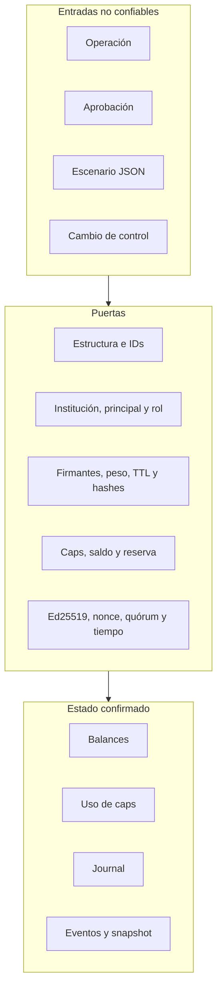
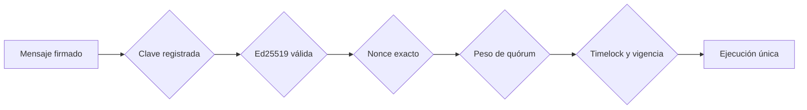

# Política de seguridad de BastilleDTL

BastilleDTL protege operaciones institucionales mediante controles de identidad,
aprobación, exposición, liquidez, journal y gobierno. Este documento define la
frontera de confianza, las garantías esperadas y el proceso responsable para
comunicar un hallazgo de seguridad.

## Versiones mantenidas

| Versión | Estado     | Actualizaciones de seguridad |
| ------- | ---------- | ---------------------------- |
| `1.0.x` | Producción | Sí                           |
| `< 1.0` | Histórica  | No                           |

La referencia operativa es la etiqueta anotada más reciente cuya suite CI e
integridad de release hayan finalizado correctamente.

## Fronteras de confianza



Una estructura deserializada no conserva autoridad por sí misma. El servicio
vuelve a comprobar contexto, rol, estado de cuenta, activo, rail, importe,
vigencia y capacidad en el punto de ejecución.

## Activos protegidos

- Balances disponibles y reservados por cuenta y activo.
- Instrucciones internas y retiros externos.
- Firmantes activos, pesos, roles y ventanas de rotación.
- Aprobaciones, hashes, TTL y decisiones.
- Caps de exposición y flujos aplicados.
- Reservas intradía, floors y add-ons de estrés.
- Configuraciones de política y sus digests.
- Journal, eventos, receipts y snapshots.
- Nonces, votos y acciones de control ejecutadas.

## Actores

| Actor              | Autoridad                     | Restricciones                             |
| ------------------ | ----------------------------- | ----------------------------------------- |
| Operador           | presentar operaciones         | cuenta, rol, saldo, caps y aprobaciones   |
| Tesorero           | aprobar dentro de su límite   | institución, vigencia y peso              |
| Riesgo             | aprobar y gestionar firmantes | política y trazabilidad                   |
| Auditor            | consultar snapshot y eventos  | sin autoridad de ejecución                |
| Revisor de control | firmar propuestas o votos     | nonce, quórum y timelock                  |
| Integrador         | invocar CLI y parsear JSON    | no se considera una frontera de autoridad |

El cliente, el fixture y la red de transporte se consideran controlados por un
adversario. Las claves privadas y el host que las almacena quedan fuera del
estado del protocolo.

## Autorización de operaciones

### Contexto

Antes de consultar aprobaciones, el servicio valida:

- institución y principal existentes y activos;
- cuenta fuente activa y perteneciente a la institución;
- activo permitido por la cuenta;
- rol del principal para la clase de operación;
- destino interno o rail externo con formato válido;
- importe positivo y ventana temporal.

### Firmantes

Un firmante aporta institución, principal, rol, peso, límite de importe, epoch
de activación y retiro. Solo un firmante activo y con rol habilitado cuenta para
el quórum.

### Bundle de aprobación

El bundle informa:

```text
required
accepted / rejected
signerIds
weight
partialHash / fullHash
operationBound
reuseDetected
```

Los consumidores que apliquen una política adicional deben exigir
`operationBound == true` y tratar cualquier señal de auditoría como motivo de
contención. Los hashes, IDs y signer IDs deben conservarse con el receipt.

### Vigencia

Una aprobación debe estar activa, expresar una decisión positiva y no superar
`ExpiresEpoch`. La rotación retira una identidad anterior y activa una nueva en
el epoch autorizado.

## Controles económicos

### Ledger

El ledger separa `available` y `reserved`. Ninguna transferencia, retiro,
reserva o liberación acepta importes no positivos ni deja saldos negativos.

El journal asigna IDs secuenciales y registra:

- epoch;
- clase de entrada;
- fuente y destino;
- activo e importe;
- operación relacionada;
- memo operativo.

### Exposición

La admisión proyecta el uso antes de aplicarlo:

```text
projected = currentUsed + operationAmount
accepted  = projected <= configuredLimit
```

Los caps pueden limitar por institución, cuenta, activo y clase. La reversión
queda registrada como flujo negativo con motivo.

### Tesorería

El planificador valida referencias únicas, ventanas uniformes, cardinalidad,
activos y partes. Calcula posiciones netas por cuenta, reserva bajo estrés y
concentración por rail con aritmética entera.

Un plan solo está listo cuando:

```text
stressedReserve(asset) <= availableReserve(asset)
railGross(rail) <= configuredCap(rail)
railShareBps(rail) <= maxRailShareBps
```

## Gobierno criptográfico

Las propuestas y votos usan dominios distintos:

```text
bastille-control-change-v1
bastille-control-vote-v1
```

Cada mensaje se firma con Ed25519. El comité compara la clave pública en tiempo
constante con el registro, verifica firma, institución, rol y nonce, y después
acumula peso.



La firma de voto no es válida como propuesta. El digest de configuración debe
ser hexadecimal de 32 bytes y toda acción exige motivo no vacío.

## Nonces y repetición

Cada revisor mantiene un nonce independiente:

```text
received == expected
next = expected + 1
```

Una firma con nonce anterior, futuro o desbordado se rechaza. Los digests
pendientes, ejecutados o cancelados no se pueden registrar otra vez y un revisor
solo puede votar una vez por acción.

## Seguridad de integración

- stdout contiene solo JSON confirmado.
- stderr y el código de salida comunican rechazo.
- El integrador debe imponer timeout y límite de salida.
- Los importes cruzan JSON como cadenas y se convierten a `bigint`.
- Un proceso terminado sin documento completo no confirma una operación.
- Los IDs se usan para idempotencia; no se incrementan nonces de forma
  especulativa.
- Los logs no incluyen claves privadas ni payloads secretos.

## Invariantes de revisión

1. Ningún balance disponible o reservado es negativo.
2. Un retiro no supera saldo ni caps aplicables.
3. Una transferencia interna acredita exactamente lo debitado.
4. Un firmante inactivo no aporta peso.
5. Una aprobación expirada no forma parte del bundle aceptado.
6. Un plan separa posiciones, reservas y rails por activo.
7. Un cambio de control no evita firma, nonce, quórum o timelock.
8. Un rechazo conserva trazabilidad y no se presenta como ejecución.
9. La versión Go, npm y etiqueta coinciden.

## Verificación antes de publicar

```bash
bash scripts/ci.sh
go test -race ./...
```

PowerShell:

```powershell
.\scripts\ci.ps1
```

La publicación requiere además:

- `main`, `production` y `v1.0.0^{}` en el mismo commit;
- etiqueta anotada;
- release no draft y no prerelease;
- CI de candidato, pull request, main, production y tag correcta;
- integridad de etiqueta y release correcta;
- ausencia de secretos en el historial y artefactos.

## Comunicación responsable

Use **Security → Report a security issue** en GitHub. No abra una discusión
pública con instrucciones de impacto antes de que el equipo confirme la
recepción.

Incluya:

- versión, commit y plataforma;
- componente y supuesto de confianza afectado;
- secuencia mínima de reproducción;
- impacto contable u operativo observado;
- logs sin credenciales;
- propuesta de corrección, si está disponible.

No incluya claves privadas, tokens, datos personales, endpoints internos ni
información de terceros. Se coordinará una ventana de corrección y publicación
proporcional al impacto.
