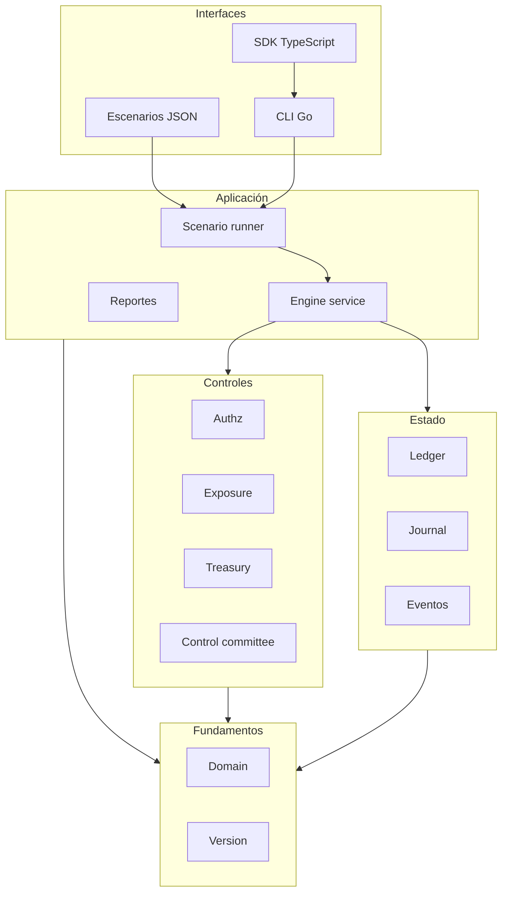
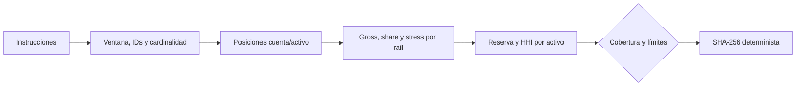

# Arquitectura de BastilleDTL

## Propósito

BastilleDTL organiza una operación institucional como una secuencia de contexto,
autorización, riesgo, contabilidad y auditoría. El servicio evita que el cliente
controle estado interno: recibe contratos de dominio, deriva hashes e IDs y
publica receipts y snapshots serializables.

La arquitectura se divide en dominios independientes para revisar cada frontera
sin mezclar reglas de identidad con aritmética o persistencia.

## Vista de contenedores



## Fundamentos de dominio

`src/domain` define:

- IDs tipados para institución, cuenta, principal, firmante, operación,
  aprobación, evento, journal y cap;
- `Money` como `int64` acotado, con suma, resta y multiplicación comprobadas;
- activos, balances, cuentas, roles y principals;
- operaciones internas y retiros;
- aprobaciones, bundles y usos;
- política del motor y caps;
- errores con código estable;
- snapshots y señales de auditoría.

Los módulos superiores comparten estos contratos; no intercambian mapas sin
tipo ni importes en coma flotante.

## Servicio de aplicación

`engine.Service` mantiene el epoch y orquesta los registros. El orden de
ejecución es deliberado:


Un error de contexto, política, autorización, exposición o saldo marca la
operación como rechazada. El receipt de éxito enlaza ledger entry, bundle,
admisión, destino y hashes.

## Autorización

`authz` contiene tres registros:

- `SignerRegistry`: altas, consulta activa y rotación;
- `ApprovalRegistry`: creación, resolución, uso y revocación;
- `Verifier`: selección de firmantes, TTL, roles, peso y hashes.

El hash económico permite agrupación de riesgo y el hash completo identifica la
instrucción detallada. El bundle expone ambos para que la capa de auditoría y el
integrador puedan correlacionar consentimiento y ejecución.

## Exposición

`exposure.Book` administra caps y flujos. `Admit` es una vista sin mutación;
`Apply` vuelve a calcular la admisión y registra uso. `Reverse` compensa el uso
con un flujo negativo y un motivo.

Los caps se seleccionan por coincidencia de:

```text
institution
account?
asset
operationKind?
enabled
```

El orden de los resultados se estabiliza por `CapID`.

## Ledger y journal

`ledger.Book` protege balances con mutex y separa `Available` de `Reserved`.
Cada mutación escribe una entrada secuencial. Las operaciones disponibles son:

- seed inicial;
- reserva y liberación;
- transferencia entre cuentas;
- retiro hacia rail externo;
- crédito y débito operativos.

Los snapshots se ordenan por cuenta y activo. `AssertSolvent` comprueba que
ningún componente de saldo sea negativo.

## Planificador de tesorería

`treasury.Planner` es una vista previa determinista. No modifica ledger ni caps.
Recibe instrucciones, reservas y límites y devuelve posiciones, resúmenes por
rail, cobertura por activo, motivos y digest.



Mapas y sets se convierten a slices ordenados antes de formar el digest. El HHI
usa `math/big` para que el cuadrado de un importe no desborde `int64`.

## Comité de control

`control.Committee` no modifica directamente el engine. Devuelve un `Change`
autorizado que el operador aplica al dominio correspondiente. Esta separación
mantiene el control criptográfico independiente de la implementación del cambio.

El comité conserva:

- revisores y claves públicas Ed25519;
- peso de quórum;
- nonces por revisor;
- acciones pendientes;
- digests ejecutados y cancelados.

## Escenarios

Un `scenario.Definition` combina un bootstrap y acciones. Si no aporta
bootstrap, usa una configuración determinista. Las acciones posibles son:

```text
approve
execute
rotate
advance
snapshot
report
```

Las referencias de aprobación por etiqueta se resuelven dentro del runner. Esto
mantiene los fixtures legibles sin convertir las etiquetas en IDs de dominio.

## CLI y serialización

`cmd/bastilledtl` ofrece:

```text
bastilledtl run <scenario.json>
bastilledtl default
bastilledtl version
```

El encoder JSON usa indentación estable. `src/version` centraliza protocolo,
versión y versión de esquema para que release y binario se puedan comparar.

## Concurrencia

Ledger, exposición, registros y servicio protegen estado mutable con mutex. Las
funciones evitan devolver slices o claves que compartan memoria interna. Los
read models se copian y ordenan antes de salir.

El race detector forma parte de GitHub Actions:

```bash
go test -race ./...
```

## Mapa del repositorio

```text
assets/              identidad visual
cmd/bastilledtl/      binario
docs/                diseño y runbooks
sdk/                 cliente TypeScript
scripts/             puertas locales y estructura
src/authz/           firmantes y aprobaciones
src/control/         gobierno Ed25519
src/domain/          contratos base
src/engine/          orquestación y auditoría
src/exposure/        caps y flujos
src/ledger/          balances y journal
src/report/          JSON
src/scenario/        fixtures y runner
src/treasury/        liquidez, stress y HHI
src/version/         información de versión
tests/               escenarios de integración
```

## Extensión segura

1. Definir el contrato en el dominio propietario.
2. Validar IDs, importes y cardinalidad antes de mutar.
3. Incluir campos económicos en hashes y receipts.
4. Mantener orden determinista en snapshots y digests.
5. Añadir tests de aceptación, rechazo, límite y repetición.
6. Ejecutar tests con race detector.
7. Documentar migración, observabilidad y reversión.
