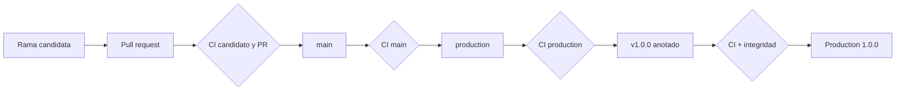
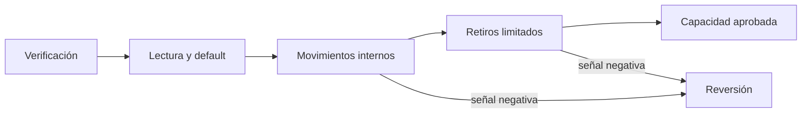

# Despliegue

## Estrategia

BastilleDTL se distribuye como binario Go junto con SDK y documentación. La
promoción exige un pull request validado, `main`, rama `production`, etiqueta
anotada y release sobre el mismo commit.



## Herramientas

```bash
go version
node --version
npm --version
```

La construcción usa `go.mod` y `package-lock.json`. No actualice dependencias
durante una release.

## Build reproducible

```bash
npm ci
go build -trimpath -ldflags="-s -w" -o bin/bastilledtl ./cmd/bastilledtl
```

PowerShell:

```powershell
go build -trimpath -ldflags "-s -w" -o .\bin\bastilledtl.exe .\cmd\bastilledtl
Get-FileHash -Algorithm SHA256 .\bin\bastilledtl.exe
```

Registrar:

- GOOS y GOARCH;
- versión Go;
- commit y tag;
- flags de build;
- SHA-256 del binario;
- versión JSON informada por el binario.

## Puerta previa

```bash
bash scripts/ci.sh
go test -race ./...
```

Incluye formato, tests, vet, build, lockfile npm, Prettier, typecheck, escenarios,
SDK, estructura documental y tamaño del dominio.

No publicar desde un worktree con cambios sin registrar.

## Configuración

Una configuración externa debe fijar:

- institución y jurisdicción;
- catálogo de activos y decimales;
- cuentas, clases, estado y assets permitidos;
- principals y roles;
- firmantes, pesos, límites y epochs;
- balances y reservas;
- caps y ventanas;
- rails permitidos;
- umbrales de aprobación;
- buffers, shocks y cuotas de tesorería;
- revisores, claves públicas, quórum y nonces.

Serialice el payload canónicamente y registre SHA-256. Los secretos no forman
parte de la configuración versionada.

## Secretos

El motor base usa claves públicas en control. Las claves privadas pertenecen al
proceso de firma y deben:

- almacenarse en HSM o gestor de secretos;
- limitarse por entorno y rol;
- rotarse con procedimiento documentado;
- no aparecer en argumentos, stdout o stderr;
- no copiarse a imágenes o artefactos;
- no formar parte de fixtures.

## Promoción

Tras fusionar:

```bash
git fetch origin
git switch main
git pull --ff-only origin main
git push origin main:production
git tag -a v1.0.0 -m "Production 1.0.0"
git push origin v1.0.0
```

Verificar:

```bash
git fetch origin main production --tags
test "$(git rev-parse origin/main)" = "$(git rev-parse origin/production)"
test "$(git rev-parse origin/main)" = "$(git rev-parse 'v1.0.0^{}')"
test "$(git cat-file -t refs/tags/v1.0.0)" = "tag"
```

`release-integrity.yml` repite la comparación y valida versiones Go/npm.

## Rollout



Fases:

1. validar `version` y `default`;
2. ejecutar smoke test sin salida externa;
3. habilitar movimientos internos con cap reducido;
4. habilitar un rail y volumen limitado;
5. observar saldos, caps, reservas, HHI y auditoría;
6. ampliar mediante acción de control.

## Health check

```ts
const health = await client.health("health.json");

if (!health.solvent) throw new Error("negative balance detected");
if (!health.withinExposure) throw new Error("exposure limit exceeded");
if (health.activeSigners < 2) throw new Error("insufficient signer coverage");
if (health.securitySignals > 0) throw new Error("security review required");
```

La disponibilidad del proceso no sustituye estos invariantes.

## Reversión

1. detener nuevas operaciones;
2. capturar snapshot, journal y flujos;
3. preservar binario y SHA-256 actuales;
4. comprobar compatibilidad del estado;
5. desplegar binario anterior por digest;
6. reproducir escenario de health;
7. reconciliar balances y caps;
8. reanudar gradualmente.

No mover una etiqueta existente. Publique una nueva versión para documentar la
reversión.

## Matriz de evidencia

| Fase       | Evidencia         | Condición                  |
| ---------- | ----------------- | -------------------------- |
| Build      | binario + SHA-256 | build bloqueado correcto   |
| Test       | logs CI y race    | suites correctas           |
| Main       | commit remoto     | CI correcta                |
| Production | commit remoto     | igual a main y CI correcta |
| Tag        | objeto anotado    | resuelve a production      |
| Release    | GitHub Release    | no draft, no prerelease    |
| Smoke      | JSON y snapshot   | invariantes correctos      |

## Post-despliegue

- [ ] Commit, tag y SHA-256 registrados.
- [ ] `main` y `production` coinciden.
- [ ] CI e integridad correctas.
- [ ] Versión Go/npm coincidente.
- [ ] Bootstrap y digest archivados.
- [ ] Balances no negativos.
- [ ] Caps dentro de límite.
- [ ] Reserva sin déficit.
- [ ] Firmantes y revisores activos suficientes.
- [ ] Alertas y reversión disponibles.
