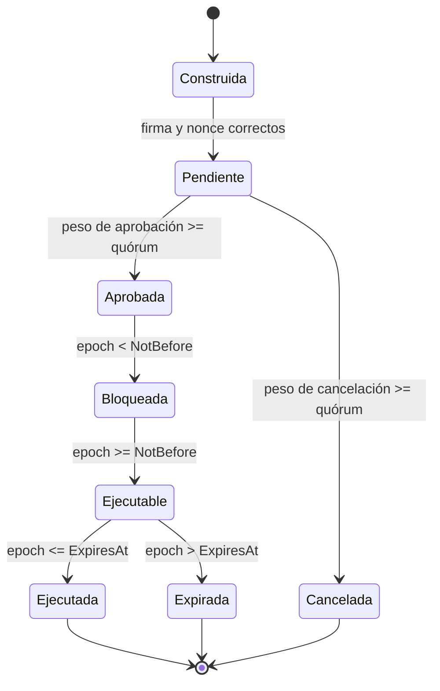
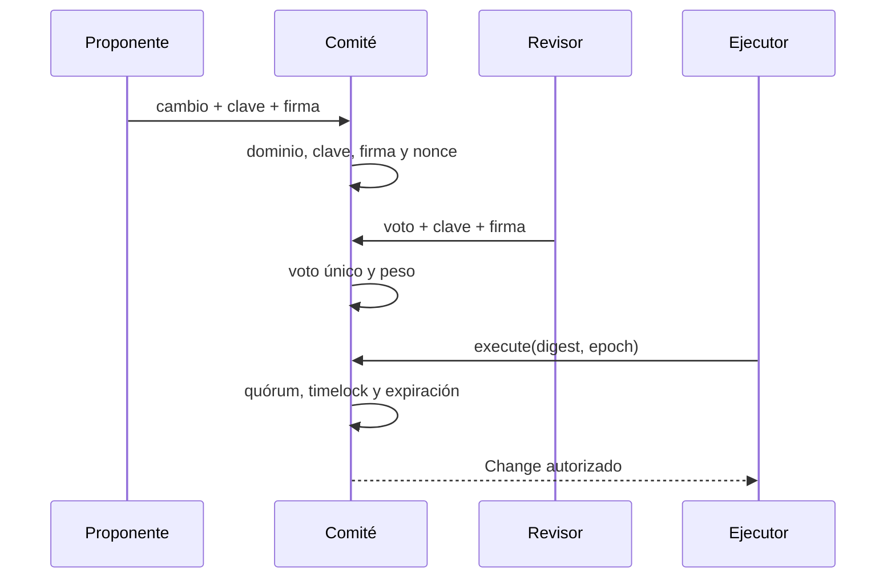

# Gobierno del protocolo

## Alcance

El gobierno de BastilleDTL autoriza cambios sensibles mediante propuestas y
votos Ed25519. El comité no aplica la configuración: devuelve un objeto aprobado
para que el operador lo compare con el payload y lo ejecute en el dominio
correcto.

## Tipos de cambio

| Tipo                    | Finalidad                           |
| ----------------------- | ----------------------------------- |
| `engine_policy`         | umbrales, TTL, roles y caps diarios |
| `signer_set`            | composición y peso de firmantes     |
| `exposure_cap`          | límites por cuenta, activo o clase  |
| `rail_policy`           | rails, cuotas, caps y shocks        |
| `reserve_floor`         | buffers y reserva mínima            |
| `emergency_restriction` | reducción temporal de capacidad     |

Una acción de emergencia restringe; no transfiere balances ni altera el
journal histórico.

## Roles

- **Proponente:** revisor registrado que firma el cambio.
- **Revisor:** identidad Ed25519 con rol habilitado y peso.
- **Ejecutor:** proceso que solicita materializar el digest aprobado.
- **Operador:** compara payload, registra evidencia y aplica la configuración.
- **Monitor:** observa el timelock y las señales posteriores.

El proponente aporta el primer peso de aprobación. El ejecutor no obtiene peso
por solicitar ejecución.

## Payload

```text
ID
Institution
Kind
ConfigDigest
Proposer
Nonce
NotBefore
ExpiresAt
Reason
```

`ConfigDigest` es SHA-256 hexadecimal del payload que se aplicará. El operador
debe reconstruirlo y comparar antes de cambiar estado.

La ventana cumple:

```text
NotBefore < ExpiresAt
```

## Ciclo de vida



El digest identifica la acción. Un digest pendiente, ejecutado o cancelado no se
puede volver a presentar.

## Firmas

Cada tipo de mensaje tiene dominio:

```text
bastille-control-change-v1
bastille-control-vote-v1
```

Flujo:



Modificar `NotBefore`, `ExpiresAt`, motivo, digest o cualquier otro campo
invalida la firma.

## Nonces

Cada revisor comienza en `0` y consume exactamente el esperado. Propuesta y
voto comparten la secuencia del revisor, evitando que una firma antigua pueda
entrar por otro método.

```text
received == expected
expected = expected + 1
```

El contador no acepta saltos y detecta overflow.

## Quórum ponderado

El quórum se expresa como peso total, no como número de claves. Esto permite
separar revisores de distinto alcance sin contar una identidad dos veces.

Ejemplo:

| Revisor    | Rol       | Peso |
| ---------- | --------- | ---: |
| Treasury A | treasurer |    1 |
| Risk B     | risk      |    2 |
| Admin C    | admin     |    3 |

Con quórum `4`, combinaciones aceptables incluyen `A+C` o `B+C`. `A+B` no
alcanza el umbral.

La suma satura en `uint16` para no desbordar durante una configuración extrema.

## Votos

Cada revisor puede elegir `approve` o `cancel`. Un revisor que ya aparece en
cualquiera de los dos conjuntos no puede votar otra vez.

```text
approvalWeight     = Σ peso de approvals únicos
cancellationWeight = Σ peso de cancellations únicas
```

La cancelación elimina la acción de pendientes y conserva su digest en el
registro de canceladas.

## Gestión de revisores

Al registrar:

- ID e institución válidos;
- rol capaz de aprobar;
- peso positivo;
- clave pública Ed25519 de 32 bytes;
- estado activo.

Una retirada se rechaza si:

- el revisor no está activo;
- el peso restante queda por debajo del quórum;
- el revisor tiene un voto en una acción pendiente.

Secuencia recomendada:

1. registrar la nueva clave;
2. confirmar firma y nonce inicial;
3. ajustar quórum si procede;
4. resolver acciones pendientes;
5. retirar la clave anterior;
6. archivar evidencia.

## Timelock

Guía operativa:

| Clase      | Ejemplo              | Demora recomendada |
| ---------- | -------------------- | -----------------: |
| Operativa  | ajuste menor de rail |          1 ventana |
| Económica  | cap o buffer         |         2 ventanas |
| Identidad  | rotación de conjunto |         3 ventanas |
| Emergencia | restricción          | mínima documentada |

El código aplica epochs; la equivalencia temporal depende del entorno.

## Ceremonia

1. Preparar payload anterior y posterior.
2. Calcular SHA-256 y registrar motivo.
3. Definir inicio, expiración y plan de reversión.
4. Firmar propuesta con nonce exacto.
5. Recoger votos de identidades independientes.
6. Observar señales durante el timelock.
7. Recalcular digest antes de ejecutar.
8. Aplicar el cambio una sola vez.
9. Archivar digests, firmas, nonces y resultado.

## Evidencia

Por acción conservar:

- payload y `ConfigDigest`;
- change digest;
- clave y firma del proponente;
- votos, firmas, decisiones, pesos y nonces;
- quórum vigente;
- epochs;
- resultado ejecutado o cancelado;
- versión y commit;
- métricas antes y después.

## Fallos operativos esperados

| Condición                 | Resultado              |
| ------------------------- | ---------------------- |
| clave distinta            | rechazo                |
| firma alterada            | rechazo                |
| nonce repetido o futuro   | rechazo                |
| digest ya conocido        | rechazo                |
| voto duplicado            | rechazo                |
| peso insuficiente         | permanece pendiente    |
| ejecución temprana        | rechazo por timelock   |
| ejecución tardía          | rechazo por expiración |
| retirada que rompe quórum | rechazo                |

## Checklist

- [ ] Payload local coincide con `ConfigDigest`.
- [ ] Firmas verificadas contra claves activas.
- [ ] Nonces coinciden con el estado confirmado.
- [ ] Peso único alcanza quórum.
- [ ] Epoch dentro de la ventana.
- [ ] Plan de reversión disponible.
- [ ] Monitores de saldo, cap, reserva y rail activos.
- [ ] Resultado y versión archivados.
