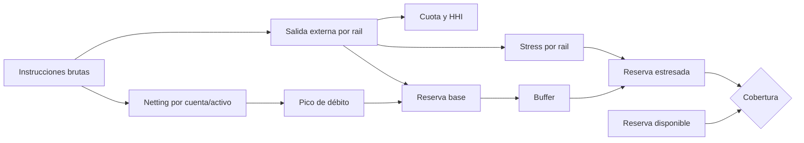

# Modelo económico

## Objetivo

El modelo de BastilleDTL relaciona balances, reservas, caps, netting intradía y
concentración de rails. Su propósito es responder tres preguntas antes de una
ventana de settlement:

1. ¿Qué cuentas aportan o reciben liquidez neta?
2. ¿Cuánta reserva necesita cada activo bajo stress?
3. ¿La salida está demasiado concentrada en un rail?

## Representación monetaria

`domain.Money` es un entero con signo acotado a una fracción de `MaxInt64` para
dejar margen a operaciones intermedias. Los importes de operaciones deben ser
positivos; los flujos de reversión pueden ser negativos en su registro.

Para un activo con `d` decimales:

```text
scale(d)      = 10^d
displayAmount = minimalUnits / scale(d)
```

El engine no usa coma flotante. Los clientes transportan importes como strings
decimales y el SDK los convierte a `bigint`.

## Saldos

Cada `(cuenta, activo)` separa:

```text
totalBalance = available + reserved
```

- `available` se puede debitar para una transferencia o retiro.
- `reserved` queda apartado hasta una liberación explícita.
- una reserva mueve valor entre componentes sin cambiar `totalBalance`.
- un movimiento interno conserva el total institucional por activo.
- un retiro reduce el inventario institucional y crea una salida externa.

## Caps de exposición

Un cap aplicable mantiene `limit` y `used`:

```text
projected = used + operationAmount
remaining = max(limit - used, 0)
admit     = projected <= limit
```

Una operación puede coincidir con varios caps. Todos deben aceptar. El cap más
específico no anula uno global; los resultados se acumulan.

Ejemplo:

| Cap                |  Límite |     Uso | Operación | Proyectado | Estado  |
| ------------------ | ------: | ------: | --------: | ---------: | ------- |
| retiro diario USDC | 700.000 | 520.000 |   100.000 |    620.000 | acepta  |
| cuenta operating   | 600.000 | 520.000 |   100.000 |    620.000 | rechaza |

El segundo control bloquea el conjunto aunque el cap diario tenga margen.

## Instrucciones de tesorería

Una instrucción aporta:

- ID único y ventana;
- institución;
- clase interna o retiro;
- cuenta fuente y, si procede, destino interno;
- beneficiario y rail para salida externa;
- activo, importe, prioridad y cutoff.

Las referencias duplicadas o las ventanas mezcladas se rechazan antes de
calcular posiciones.

## Netting por cuenta y activo

```text
grossDebit(i,a)  = Σ amount(k) donde source(k)=i y asset(k)=a
grossCredit(i,a) = Σ amount(k) donde destination(k)=i y asset(k)=a
netDebit(i,a)    = max(grossDebit(i,a) - grossCredit(i,a), 0)
netCredit(i,a)   = max(grossCredit(i,a) - grossDebit(i,a), 0)
```

Los retiros solo aportan débito interno, porque su crédito se liquida fuera de
la institución.

## Ejemplo intradía

Instrucciones USDC:

| ID  | Clase   | Fuente    | Destino / rail | Importe |
| --- | ------- | --------- | -------------- | ------: |
| I1  | interna | operating | reserve        |     100 |
| I2  | interna | reserve   | operating      |      40 |
| I3  | retiro  | operating | swift          |      60 |

Posiciones:

| Cuenta    | Débito bruto | Crédito bruto | Débito neto | Crédito neto |
| --------- | -----------: | ------------: | ----------: | -----------: |
| operating |          160 |            40 |         120 |            0 |
| reserve   |           40 |           100 |           0 |           60 |

```text
internalGross    = 140
externalGross    = 60
peakAccountDebit = 120
reserveBase      = max(60, 120) = 120
```

El pico refleja que una cuenta puede necesitar más liquidez intradía que la
salida externa neta.

## Buffer y stress

El buffer usa redondeo hacia arriba:

```text
buffer = ceil(reserveBase × reserveBufferBps / 10.000)
reserveRequired = reserveBase + buffer
```

Con `reserveBase = 120` y `buffer = 1.000 bps`:

```text
buffer          = 12
reserveRequired = 132
```

Cada rail aplica un shock:

```text
stressAddOn(r) = ceil(railGross(r) × stressBps(r) / 10.000)
stressedReserve = reserveRequired + Σ stressAddOn(r)
```

Para `swift = 60` y `2.000 bps`:

```text
stressAddOn     = 12
stressedReserve = 144
```

| Reserva disponible | Déficit | Estado        |
| -----------------: | ------: | ------------- |
|                160 |       0 | financiado    |
|                144 |       0 | financiado    |
|                143 |       1 | no financiado |

## Concentración de rails

La cuota de un rail es:

```text
shareBps(r) = floor(railGross(r) × 10.000 / externalGross)
```

El HHI es:

```text
HHI_bps = floor(10.000 × Σ railGross(r)^2 / externalGross^2)
```

Ejemplo con `swift=60` y `sepa=40`:

```text
HHI = floor(10.000 × (60² + 40²) / 100²)
    = 5.200
```

Interpretación orientativa:

|        HHI bps | Lectura                |
| -------------: | ---------------------- |
|      `< 2.500` | distribución amplia    |
| `2.500..5.000` | concentración moderada |
|      `> 5.000` | concentración alta     |
|       `10.000` | un solo rail           |

El límite operativo se aplica también a la cuota individual de cada rail.

## Cap por rail

```text
withinLimit = railGross <= configuredCap
remaining   = configuredCap - railGross
```

El plan conserva la señal aunque otras capas dispongan de saldo. Un exceso de
cap o cuota hace `Ready=false`.

## Diagrama económico



## Determinismo del plan

El digest SHA-256 incluye:

- versión de dominio;
- ventana y cardinalidad;
- posiciones ordenadas;
- resúmenes de rail ordenados;
- resúmenes de activo ordenados.

El orden de entrada no cambia el digest. Un cambio de importe, reserva, rail,
stress o posición sí lo cambia.

## Parámetros de control

| Parámetro             | Finalidad                 | Rango       |
| --------------------- | ------------------------- | ----------- |
| `MaxInstructions`     | acota trabajo por ventana | `> 0`       |
| `MaxAccountsPerAsset` | acota cardinalidad        | `>= 2`      |
| `ReserveBufferBps`    | margen base               | `0..10.000` |
| `MaxRailShareBps`     | concentración individual  | `0..10.000` |
| `MaxRailGross`        | volumen absoluto por rail | positivo    |
| `RailStressBps`       | shock específico          | `0..10.000` |

Los cambios requieren digest, motivo, quórum y una ventana de activación.

## Reconciliación

Por ventana se conservan:

1. conjunto de instrucciones y digest;
2. posiciones por cuenta y activo;
3. bruto interno y externo;
4. rails, cuotas y HHI;
5. reserva base, buffer y stress;
6. déficits y motivos;
7. receipts y journal de operaciones confirmadas.

La suma de movimientos internos debe conservar inventario institucional. Cada
retiro confirmado debe explicar una reducción equivalente y una entrada de
journal.
