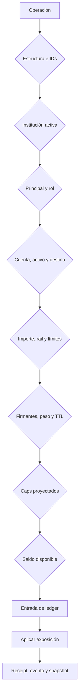

# Modelo de seguridad

## Resumen

BastilleDTL aplica defensa en profundidad a operaciones de tesorería. La
autorización humana no sustituye el control de contexto, y un saldo suficiente
no sustituye los caps, la cobertura de reserva o la trazabilidad.

El objetivo es que toda transformación confirmada tenga identidad, consentimiento,
capacidad y evidencia reconciliables.

## Principios

1. **Contexto completo:** institución, cuenta, activo, clase y destino se validan.
2. **Mínimo privilegio:** principals y firmantes aportan roles distintos.
3. **Autoridad ponderada:** las operaciones grandes requieren peso suficiente.
4. **Temporalidad:** aprobaciones, firmantes y cambios tienen vigencia.
5. **Límites acumulativos:** todos los caps coincidentes deben aceptar.
6. **Liquidez conservadora:** buffer y stress usan redondeo hacia arriba.
7. **Trazabilidad:** IDs, hashes, journal y eventos enlazan el flujo.
8. **Gobierno demorado:** cambios sensibles requieren firma, quórum y timelock.

## Cadena de validación



Un rechazo termina el flujo y produce un código de dominio. El integrador no
debe convertir un error en confirmación parcial.

## Identidad y roles

### Institución

Activos, cuentas, principals, firmantes, caps y operaciones se vinculan a una
institución. El bootstrap rechaza referencias a entidades inexistentes y IDs
duplicados.

### Principal

Un principal debe estar habilitado y aportar el rol requerido:

| Operación          | Rol de envío     |
| ------------------ | ---------------- |
| movimiento interno | `internal`       |
| retiro             | `withdrawal`     |
| administración     | `admin` o `risk` |

`operator` y `admin` pueden cubrir funciones de envío según la política.

### Firmante

Un firmante es utilizable cuando:

- su status es `active`;
- `epoch >= ActivatedEpoch`;
- no alcanzó `RetiredEpoch`;
- su rol puede aprobar;
- su `MaxAmount` cubre la operación;
- su peso es positivo.

## Aprobaciones

Una aprobación registra operación, institución, firmante, decisión, status,
hashes, clase, importe, activo, fuente, epochs, peso y motivo.

La verificación:

1. resuelve todos los IDs solicitados;
2. compara el hash económico de la solicitud;
3. comprueba decisión, status y TTL;
4. impide duplicar firmantes en un bundle;
5. recupera la identidad activa del registro;
6. valida institución, rol, importe y peso;
7. informa enlace al objeto completo y señales de auditoría;
8. exige número y peso mínimos.

Los receipts deben archivarse junto con `PartialHash`, `FullHash`, signer IDs y
`OperationBound`.

## Rotación

La rotación exige un actor con autoridad de gestión. La identidad retirada deja
de estar activa en el epoch definido y la nueva identidad debe pertenecer a la
misma institución, tener rol y límite válidos y respetar la demora configurada.

El runbook conserva:

- identidad anterior y nueva;
- actor;
- epoch;
- motivo;
- grupo de rotación;
- operaciones pendientes relacionadas.

## Integridad contable

`ledger.Book` serializa mutaciones con mutex. Antes de debitar:

```text
amount > 0
available >= amount
```

Las reservas mantienen:

```text
available_before + reserved_before
= available_after + reserved_after
```

Los movimientos internos mantienen el total entre las dos cuentas; los retiros
reducen el saldo fuente y crean una entrada externa identificada por rail y
beneficiario.

## Exposición

La admisión es una proyección sin mutación. `Apply` repite el control antes de
incrementar. Una reversión nunca deja uso negativo.

Señales de auditoría incluyen:

- saldo negativo;
- uso por encima de cap;
- diferencias entre aprobación y operación;
- diferencias de hash completo;
- estado de firmantes y operaciones rechazadas.

Una señal crítica activa contención y reconciliación; no se corrige editando el
snapshot.

## Liquidez y concentración

El planificador trabaja fuera del ledger y produce un digest verificable. Sus
controles incluyen:

- IDs únicos;
- una sola ventana;
- partes distintas en movimientos internos;
- beneficiario y rail en retiros;
- límites de instrucciones y cuentas;
- importes positivos;
- reserva no negativa;
- basis points acotados;
- caps y cuotas por rail.

El HHI usa enteros arbitrarios para no perder seguridad por overflow en
`amount²`.

## Gobierno Ed25519

### Dominios

Propuesta y voto no comparten dominio. La serialización incluye todos los campos
que determinan autoridad y tiempo.

```text
change = domain | id | institution | kind | configDigest | proposer |
         nonce | notBefore | expiresAt | reason

vote   = domain | changeDigest | reviewer | nonce | decision
```

### Verificación

- longitud de clave pública Ed25519;
- comparación en tiempo constante;
- firma sobre mensaje canónico;
- revisor activo y rol habilitado;
- institución igual a la propuesta;
- nonce exacto;
- digest desconocido;
- peso de quórum;
- timelock y expiración.

### Cancelación

Aprobación y cancelación acumulan pesos separados. Una cancelación necesita su
propio quórum; un voto de cancelación no resta silenciosamente peso aprobado.

## Concurrencia

Los registros internos usan mutex y devuelven copias. La suite remota ejecuta:

```bash
go test -race ./...
```

Un nuevo módulo con estado debe demostrar que no devuelve mapas, slices o claves
mutables compartidas.

## Seguridad del SDK

El SDK reduce errores de frontera:

- rechaza `number` fuera del rango seguro;
- no acepta signo, exponente ni ceros ambiguos en strings;
- usa `bigint` para importes y cuadrados;
- valida basis points;
- separa posiciones por cuenta y activo;
- detecta IDs duplicados;
- serializa bigint a string.

La validación TypeScript no concede autoridad. Go vuelve a evaluar toda entrada.

## Observabilidad

Registrar:

- operation ID, approval IDs y signer IDs;
- partial/full hash;
- cap actual, proyectado y límite;
- ledger entry ID;
- balance y reserva resultantes;
- digest de plan de tesorería;
- change digest, revisores y nonces;
- versión y commit.

No registrar claves privadas, semillas, tokens ni payloads sensibles completos.

## Checklist de revisión

- [ ] IDs y cardinalidad validados antes de mutar.
- [ ] Aritmética comprobada y sin floats.
- [ ] Nuevos campos económicos presentes en hashes y receipts.
- [ ] Roles y límites verificados en el punto de uso.
- [ ] Un rechazo no aparece como ejecución.
- [ ] Caps y saldos probados en el borde exacto.
- [ ] Rotación y TTL cubiertos por tests.
- [ ] Nonces y firmas cubiertos por mutación y repetición.
- [ ] Race detector correcto.
- [ ] Logs sin secretos.

## Supuestos externos

La seguridad depende de que el host proteja claves privadas, el reloj operativo
avance de manera monotónica, el journal se almacene de forma durable y el binario
corresponda a la etiqueta verificada. HSM, IAM, backups y red requieren controles
de infraestructura adicionales.
