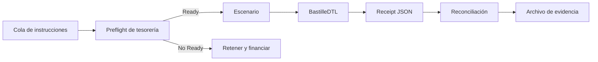
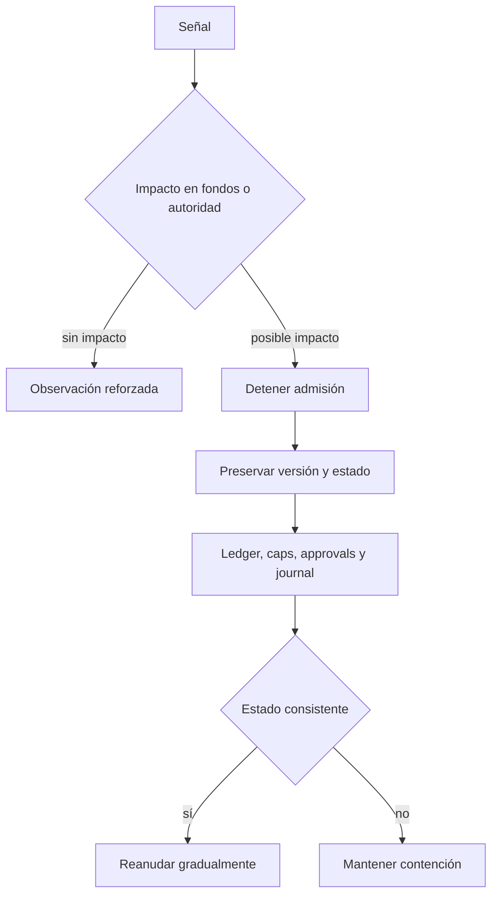

# Operaciones

## Objetivo

Este runbook cubre preparación, arranque, observabilidad, reconciliación,
contención y cierre de BastilleDTL. La interfaz actual procesa escenarios y
produce un documento JSON completo por ejecución.

## Requisitos

| Dependencia | Versión           |
| ----------- | ----------------- |
| Go          | `>= 1.22`         |
| Node.js     | `24`              |
| npm         | `>= 11`           |
| Git         | versión mantenida |

Verificar:

```bash
go version
node --version
npm --version
git status --short
```

## Comprobación de artefacto

Antes de operar una release:

```bash
git fetch origin main production --tags
git rev-parse origin/main
git rev-parse origin/production
git rev-parse 'v1.0.0^{}'
git cat-file -t refs/tags/v1.0.0
```

Los tres commits deben coincidir y el último comando debe devolver `tag`.

## Arranque

```bash
npm ci
bash scripts/ci.sh
go build -o bin/bastilledtl ./cmd/bastilledtl
./bin/bastilledtl version
./bin/bastilledtl default > bootstrap.json
```

Validar el bootstrap:

- al menos una institución, activo, cuenta, principal y firmante;
- IDs únicos;
- cuentas referencian activos existentes;
- firmantes referencian principals existentes;
- balances no negativos;
- caps con límite positivo;
- política normalizada y válida.

## Smoke test

```bash
./bin/bastilledtl run tests/fixtures/internal_movements.json > smoke.json
```

Condiciones:

| Señal            | Valor esperado         |
| ---------------- | ---------------------- |
| código de salida | `0`                    |
| JSON             | documento completo     |
| operación        | `executed`             |
| balance fuente   | no negativo            |
| exposición       | `used <= limit`        |
| audit issues     | vacío en flujo nominal |

## Ejecución



Para cada ventana:

1. construir instrucciones con IDs únicos;
2. ejecutar preview de tesorería;
3. resolver déficit y concentración;
4. obtener aprobaciones necesarias;
5. ejecutar en orden determinista;
6. archivar receipts;
7. reconciliar balances, caps y journal.

## Observabilidad

Métricas recomendadas:

- operaciones aceptadas y rechazadas por código;
- importe interno y externo por activo;
- saldo disponible y reservado por cuenta;
- uso, límite y remaining por cap;
- aprobaciones activas y tiempo hasta expiración;
- firmantes activos por rol y peso;
- posiciones netas por cuenta;
- reserva requerida, estresada y disponible;
- shortfall por activo;
- cuota y HHI de rails;
- cambios pendientes, tiempo de timelock y expiración;
- longitud de journal y eventos.

## Umbrales sugeridos

| Señal                      |    Advertencia |           Crítica |
| -------------------------- | -------------: | ----------------: |
| uso de cap                 | `>= 8.000 bps` |    `>= 9.500 bps` |
| cobertura de reserva       |       `< 1,20` |          `< 1,00` |
| cuota de rail              | `>= 5.000 bps` |   supera política |
| HHI de rails               |     `>= 5.000` |        `>= 7.500` |
| TTL restante               |       `< 25 %` |          expirada |
| señal crítica de auditoría |            n/a |        cualquiera |
| race detector              |            n/a | cualquier reporte |

Los umbrales efectivos se aprueban mediante gobierno.

## Reconciliación

### Ledger

```text
openingAvailable
+ credits
+ releases
- debits
- reserves
- withdrawals
= closingAvailable
```

Para una transferencia interna:

```text
sourceDelta + destinationDelta = 0
```

### Exposición

```text
closingUsed = openingUsed + appliedFlows - reversedFlows
closingUsed <= limit
```

### Aprobaciones

Cruzar approval IDs del receipt con registro, firmante, epoch, status, peso y
hashes. El bundle debe satisfacer la política del entorno.

### Tesorería

Reproducir el digest con las mismas instrucciones, reservas y límites. Una
diferencia indica cambios de entrada o configuración.

## Respuesta a incidentes



Orden:

1. detener nuevas instrucciones;
2. impedir cambios no relacionados;
3. registrar hora, commit, versión y digest;
4. copiar snapshot, journal, eventos y receipts;
5. identificar cuentas, activos, caps, rails y firmantes;
6. reconciliar sin editar el original;
7. preparar cambio restrictivo con reversión;
8. reanudar solo con evidencia consistente.

## Rotación de firmantes

1. verificar actor administrador o de riesgo;
2. registrar clave nueva fuera del repositorio;
3. definir epoch de activación;
4. revisar aprobaciones pendientes;
5. ejecutar rotación;
6. comprobar que la clave anterior está retirada;
7. emitir una aprobación controlada de verificación;
8. archivar evento y receipt.

## Backup

Conservar:

- binario y SHA-256;
- commit, tag y versión de esquema;
- bootstrap y digest;
- snapshots de ledger y caps;
- journal y eventos;
- firmantes y nonces;
- aprobaciones y usos;
- planes de tesorería;
- cambios de control.

No copiar claves privadas dentro del backup de aplicación.

## Cierre controlado

1. detener admisión;
2. finalizar o expirar operaciones en curso;
3. cerrar la ventana de tesorería;
4. reconciliar saldos y caps;
5. capturar snapshot final;
6. archivar journal y digests;
7. detener el proceso.

## Verificación posterior

```bash
go test ./...
npm test
./bin/bastilledtl version
```

Registrar motivo, operador, versión, snapshot inicial/final y resultado.
